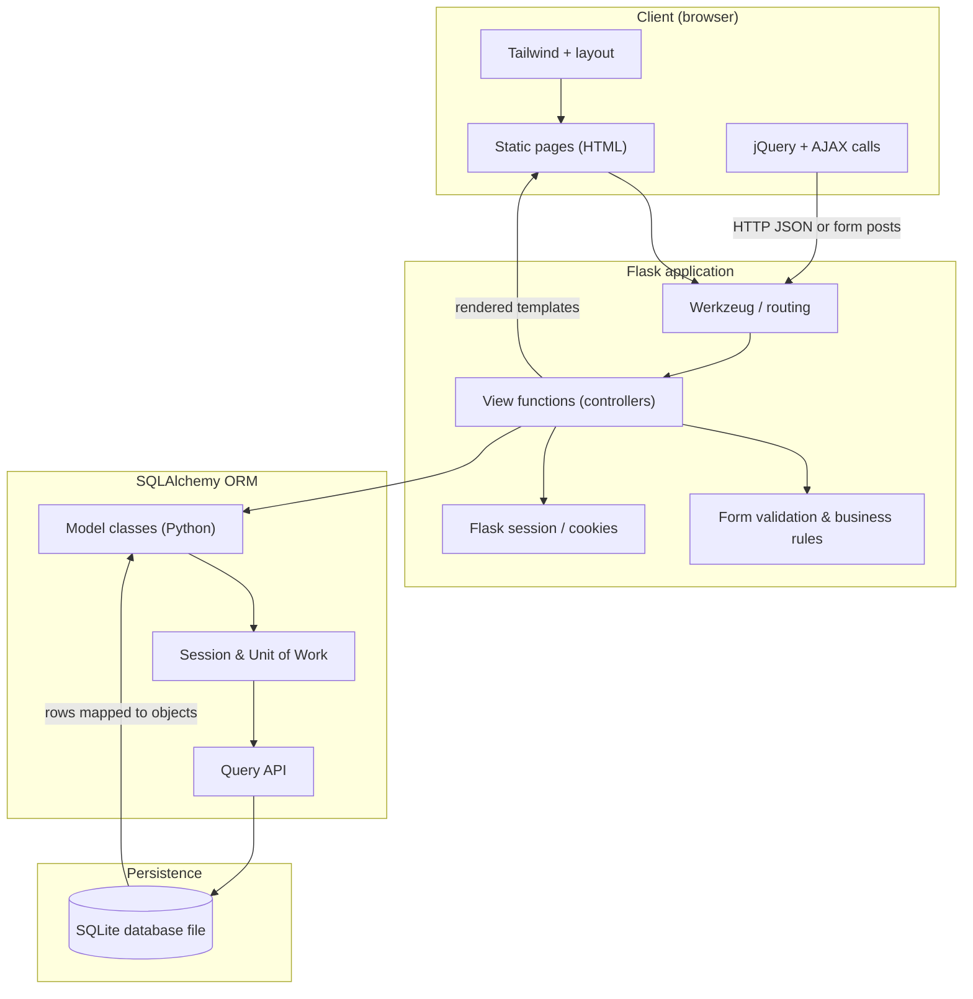
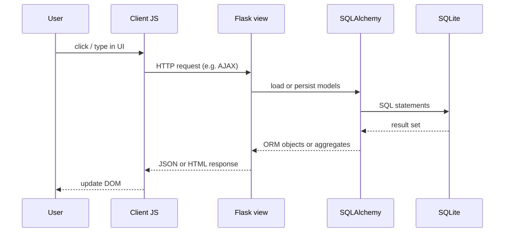

# 🎓 UWA Skill-Swap
### *Connect. Exchange. Excel.*

> **Contributing:** see [`CONTRIBUTING.md`](CONTRIBUTING.md) — it links to the [system architecture](#system-architecture) diagram below for onboarding.

**UWA Skill-Swap** is a web-based platform designed specifically for University of Western Australia students to exchange knowledge and skills. Whether you are a coding pro looking to learn guitar, or a linguist wanting to understand data science, this platform facilitates peer-to-peer learning through a persistent, user-friendly client-server application.

---

## 📖 Project Overview

### Purpose
In a university environment, students possess diverse talents beyond their primary degree. This application aims to:
*   **Bridge the knowledge gap** between different faculties.
*   **Promote community engagement** within the UWA campus.
*   **Provide a practical utility** for students to find tutors or hobbyist partners without financial barriers.

### Design & Features
*   **User Authentication:** Secure login/logout system with UWA email verification.
*   **Skill Management (CRUD):** Users can post "skills offered," edit their listings, or delete them once a partner is found.
*   **Dynamic Discovery:** A responsive homepage featuring **AJAX-powered filtering** to browse skills by category (e.g., Coding, Languages, Music) without page reloads.
*   **The "Interest" System:** A unique interaction module where users can express interest in a skill. The owner is then notified via their dashboard with the requester's contact details.
*   **Engagement:** A clean, intuitive UI built with **Tailwind CSS** focusing on accessibility and ease of use.

---

## 🛠 Tech Stack

| Layer | Technology |
| :--- | :--- |
| **Backend** | Python / Flask |
| **Database** | SQLite + SQLAlchemy (ORM) |
| **Frontend** | HTML5, CSS3 (Tailwind CSS), JavaScript |
| **Interactivity** | JQuery + AJAX |
| **Version Control** | Git / GitHub |

---

## System architecture

This section is the canonical place to understand how the **client**, the **Flask** application, and **SQLAlchemy** cooperate at runtime. New contributors should read it before opening pull requests; the [contribution guide](CONTRIBUTING.md) also points here.

The stack follows a classic three-layer shape on the server: HTTP enters Flask view functions, which delegate persistence to the ORM. The client stays thin: HTML pages plus JavaScript that issues asynchronous requests so list filtering and “interest” actions can feel responsive without full page reloads.

### High-level flow (diagram)

The diagram below is intentionally explicit about the boundaries between the browser, Flask’s request/response cycle, the SQLAlchemy session, and the SQLite file. It is a teaching aid for the unit learning outcomes and for sprint planning when we change routes or models.



### Request path (one interactive action)

A typical user-driven round trip looks like the sequence below. This is a simplified, documentation-only sketch; the real code may add redirects, error handlers, and CSRF or login checks as the project evolves.



### Legend (quick reference)

| Path | Role |
| :--- | :--- |
| Client | What the user sees; sends HTTP to Flask, receives pages or small JSON payloads. |
| Flask | Wires URLs to Python functions, enforces access rules, returns responses. |
| SQLAlchemy | Expresses domain objects and generates SQL; keeps Python types aligned with tables. |
| SQLite | Durable file-backed storage used in development and the baseline deployment story. |

### ASCII sketch (portable, copy-paste friendly)

When Mermaid is not rendered (plain text, some PDF exports), the same idea still fits in a small box:

```
+------------------+       HTTP        +-------------------------+
|  Web client      | <---------------> |  Flask (Python)         |
|  HTML / JS / CSS |   JSON, forms,    |  routes, sessions,     |
|  Tailwind UI     |   templates      |  controllers            |
+--------+---------+                    +------------+------------+
         |                                            |
         |                              +-------------v-------------+
         |                              |  SQLAlchemy ORM            |
         |                              |  models, session, queries |
         |                              +-------------+------------+
         |                                            |
         |                              +-------------v-------------+
         |                              |  SQLite (database file)   |
         |                              +---------------------------+
         |                                            |
         +--------------------------------------------+
              user sees updated lists / messages
```

### Notes for future documentation edits

* Keep this section synchronized when we add blueprints, API namespaces, or database migrations.  
* If we introduce a separate front-end build step, draw an extra box for the bundler; Flask remains the single HTTP entry for server-rendered pages in the current design.  
* For deployment diagrams (reverse proxy, WSGI server), add a separate doc; this README block stays focused on **client ↔ Flask ↔ SQLAlchemy** only.  
* The teaching team and peers should be able to trace any user story from UI touchpoint down to a model without opening more than a handful of files.  
---

## API contracts

The main AJAX-facing JSON endpoints are documented in [`docs/API_CONTRACTS.md`](docs/API_CONTRACTS.md).

This contract covers the discover filtering endpoint, tag metadata endpoint, public statistics endpoint, and dashboard chart endpoint. It is intended to keep frontend JavaScript, Flask routes, and future tests aligned as the project grows.

---

## 👥 Team Members

| UWA ID | Name | GitHub Account |
| :--- | :--- | :--- |
| `[24702822]` | Warson Long | [KenLoong](https://github.com/KenLoong) |
| `[24319908]` | Dylan Yuxuan Xi | [dylayXi](https://github.com/dylayXi) |
| `[24920808]` | Shawn Wang | [Lipo021](https://github.com/Lipo021) |
| `[24684008]` | Nuwanga Niroshan Hewa Wiladdarage | [NuwangaNiroshan](https://github.com/NuwangaNiroshan) |

---

## 🚀 Getting Started

### 1. Prerequisites
Ensure you have Python 3.10+ installed. It is recommended to use a virtual environment.

### 2. Installation
Clone the repository and install dependencies:
```bash
# Clone the repository
git clone https://github.com/KenLoong/agile-group-uwa-skill-swap.git
cd agile-group-uwa-skill-swap 

# Create and activate virtual environment
python3 -m venv venv
source venv/bin/activate  # On Windows: venv\Scripts\activate

# Install required libraries
pip install -r requirements.txt
```

### 3. Database Setup
Initialize the SQLite database:
```bash
python manage.py shell
>>> from app import db
>>> db.create_all()
>>> exit()
```

### 4. Launching the Application
Run the Flask development server:
```bash
export FLASK_APP=app.py
export FLASK_ENV=development
flask run
```
The application will be available at: `http://127.0.0.1:5000/`

---

## 🧪 Running Tests

We use the standard Python `unittest` library to ensure application stability.

To run the full test suite (including models, routes, and authentication logic):
```bash
# Run all tests
python -m unittest discover tests

# Run specific test file
python -m unittest tests/test_auth.py
```

---

## 📜 Unit Learning Outcomes (CITS5505)
This project demonstrates:
*   Implementation of **Client-Server Architecture**.
*   Proficiency in **Server-side (Flask)** and **Client-side (JS/AJAX)** technologies.
*   Application of **Agile Methodologies** through iterative Git commits.
*   Secure handling of **Data Persistence** and user sessions.
